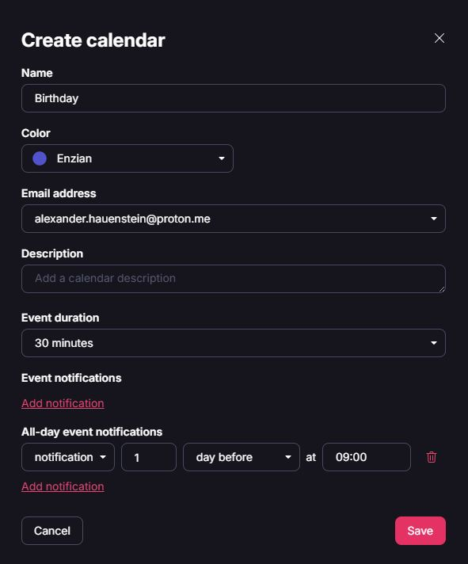
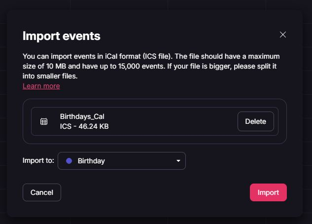
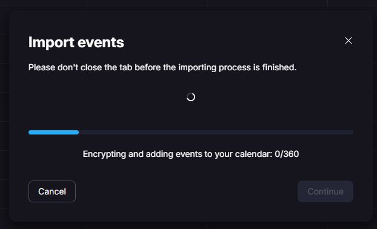
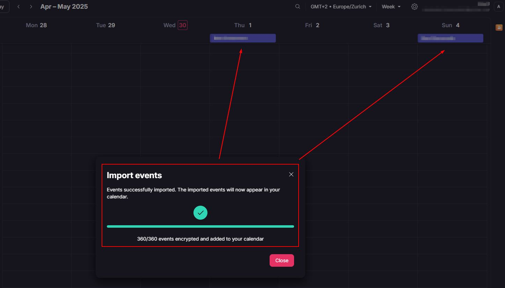

# Create ICS Cal file form Csv

Das ziel ist es :
1. Geburtstage und events aus der Birthdays Android app in ein csv zu exportieren

2. dieses script laufen zu lassen und das csv in ein ics file zu konvertieren
3. ics file in einen online calender wie "Proton Calender" zu importieren

# Proton Calender - ImportFlow 

# Importent
1. Achte daruf die Pfade für das input *.csv und output *.ics file anzupassen 
2. Proton Calender unterstützte zu dem Zeitpunkt der Erstellung keine Serientermine. Deshalb werden in dem Skript alle Geburtstage und Jubiläen für die kommenden 5 Jahre als einzelne Termine generiert.
3. Es ist immer nur ein FULL import möglich kein Inkrementeller (doppelte Einträge). Deshalb muss immer erste der Kalender geleert werden und dann frisch importiert. 
